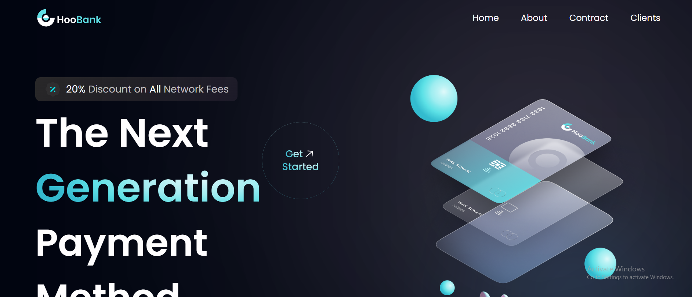
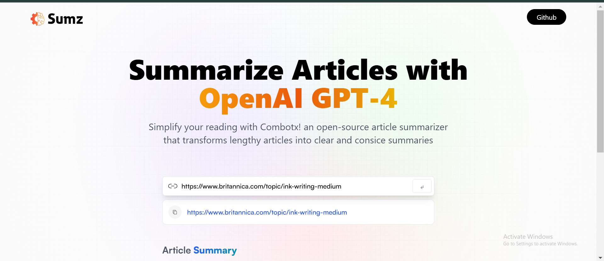
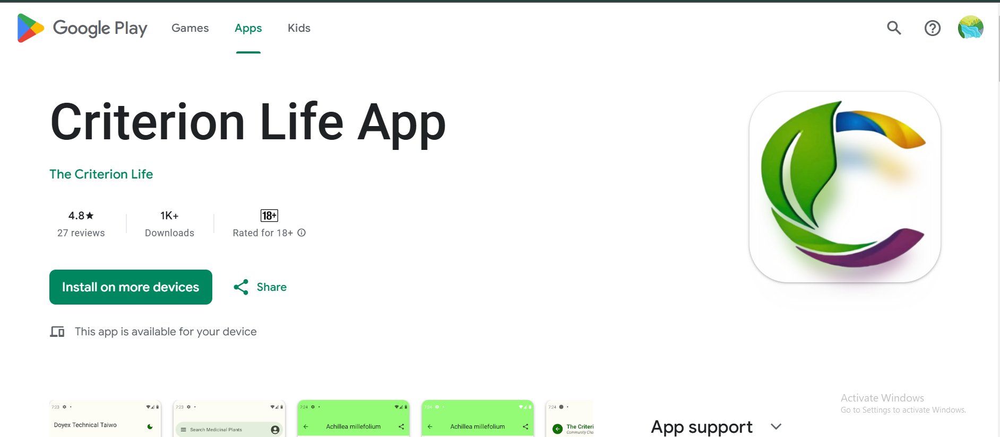

# Portfolio 👨‍💻

Welcome to my personal portfolio! This repository showcases a collection of my web, mobile, and blockchain projects that demonstrate my skills in software development. Feel free to explore the projects listed below, where you can find live demos, source code, and detailed descriptions of each project.

## Table of Contents 📚

- [About Me](#about-me)
- [Projects](#projects)
  - [HooBank](#hoobank)
  - [Summarize Articles with OpenAI GPT-4](#summarize-articles-with-openai-gpt-4)
  - [Criterion Life App](#criterion-life-app)
  - [Solana BuyBot](#solana-buybot)
  - [Smart Contracts](#smart-contracts)
- [Technologies Used](#technologies-used)
- [Setup Instructions](#setup-instructions)
- [License](#license)

## About Me 👋

I am a passionate software developer with experience in web development, mobile apps, and blockchain technology. I enjoy creating meaningful and functional applications that solve real-world problems. This portfolio highlights my best work, from responsive UI designs to innovative blockchain solutions.

## Projects 🚀

### HooBank 💳
**Category:** Web  
**Description:** A modern and responsive UI design for a bank landing page with all necessary sections and features.  
**Tech Stack:** NodeJS, React, TypeScript, Netlify, TailwindCSS  
**Demo:** [HooBank Demo](https://bank-by-doyex.netlify.app/)  
**GitHub:** [HooBank GitHub](https://github.com/mbdulrohim)  


### Summarize Articles with OpenAI GPT-4 📝
**Category:** Web  
**Description:** An open-source article summarizer that turns long articles into concise summaries using the GPT-4 API.  
**Tech Stack:** React.js, Node.js, Express, TailwindCSS, ChatGPT API  
**Demo:** [Summarize Articles Demo](https://combotx-article-sumz.netlify.app/)  
**GitHub:** [Summarize Articles GitHub](https://github.com/Mbdulrohim)  


### Criterion Life App 📱
**Category:** Mobile  
**Description:** A comprehensive app that helps you manage health, wellness, and lifestyle with ease.  
**Tech Stack:** Kotlin, Material3, Jetpack Compose, Firebase, Google Auth  
**Demo:** [Criterion Life App on Google Play](https://play.google.com/store/apps/details?id=com.doyextech.thecriterion&hl=en)  
**GitHub:** [Criterion Life GitHub](https://github.com/Mbdulrohim)  


### Solana BuyBot 🛒
**Category:** Blockchain  
**Description:** A Solana BuyBot that notifies users when a set token is bought in a Telegram group.  
**Tech Stack:** Telegram API, JavaScript, Solana Web3.js, AWS, Canvas  
**Demo:** [Solana BuyBot Demo](https://t.me/@BBirdBuyBot)  
**GitHub:** [Solana BuyBot GitHub](https://github.com/mbdulrohim)

### Smart Contracts 🔗
**Category:** Blockchain  
**Description:** Smart contracts deployed on the core blockchain and Ethereum (TestNets).  
**Tech Stack:** Solidity, Hardhat, CoreDAO Dev Tools, Ethers.js, Testnet, EVM  
**Demo:** [Smart Contracts on TestNet](https://scan.test.btcs.network/address/0x6aDEb2741D0dd6801528B1C9EC8fDc2E4474965B)  
**GitHub:** [Smart Contracts GitHub](https://github.com/mbdulrohim)

## Technologies Used 🛠️

- **Web Development:** NodeJS, React, TypeScript, TailwindCSS, Express
- **Mobile Development:** Kotlin, Jetpack Compose, Firebase, Google Auth
- **Blockchain Development:** Solidity, Hardhat, Solana Web3.js, Ethers.js, CoreDAO Dev Tools
- **Deployment & Hosting:** Netlify, AWS

## Setup Instructions ⚙️

Follow these steps to set up and run this portfolio project locally:

### **1. Clone the Repository**  
Start by cloning this repository to your local machine:

```bash
git clone https://github.com/<your-username>/portfolio.git
```

### **2. Navigate to the Project Directory**  
Change into the project directory:

```bash
cd portfolio
```

### **3. Install Dependencies**  
Install the necessary dependencies. The installation command might vary depending on the project setup:

- For a Node.js or React-based project:
  ```bash
  npm install
  ```

- For a Kotlin-based project (if you’re using Android Studio for mobile):
  - Open the project in **Android Studio**.
  - The dependencies should be automatically synced.

### **4. Set Up Environment Variables (Optional)**  
If your project uses environment variables (such as for API keys or database configurations), create a `.env` file in the root directory and add the required variables. Here’s an example of what it might look like:

```bash
REACT_APP_API_KEY=your-api-key-here
```

### **5. Run the Project**  
Now that the dependencies are installed, you can run the project:

- For a Node.js or React-based project:
  ```bash
  npm start
  ```

- For a Kotlin/Android project:
  - In **Android Studio**, press the green play button or run the following command:
    ```bash
    ./gradlew run
    ```

### **6. View the Live Demo**  
Once the project is running locally, you can view it in your browser (usually at `http://localhost:3000` for web projects or directly on your Android device for mobile apps).

## License 📝

This project is licensed under the MIT License - see the [LICENSE](LICENSE) file for details.

---

Thank you for visiting my portfolio! Feel free to reach out if you have any questions or inquiries. 😊
```

